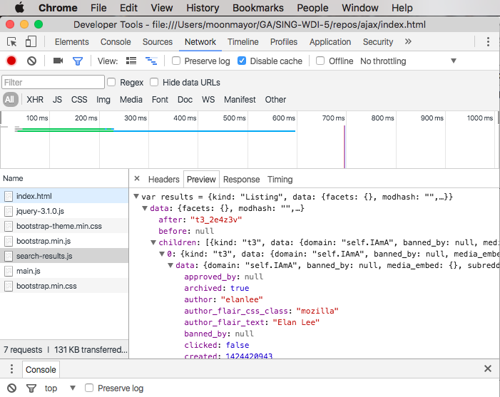

# Reddit Image Search Results JSON

This rep contains a simple web page hooked up with jQuery and BootStrap.
It contains a file `search-results.js` that declares a variable `var results`
to store JSON containing reddit image search results.

Your job is to investigate what sort of data has come back from this request
and to create new DOM elements to display it on the page.

Here's some tools you can use to investigate what the data looks like.

## Reddit Search API

Reddit allows you to search their own content. Here's their own description of
how the search endpoint of their API works.

[Reddit Search API Documentation](https://www.reddit.com/dev/api/#GET_search)

Here's how you can make a request to search their API for kittens:

```js
$.get('https://www.reddit.com/search.json', {
  q: 'kittens'
}).done(function(data) {
  console.log(data);
});
```

## Pretty Print

Although JSON is considerd a human-readable data format it can still be hard to read.
Often times JSON data that's sent to your browser from a server is compressed. The data
isn't spread over several lines, and nested data isn't indented. JSON data is often
compressed like this because it's cheaper and faster to transmit over the internet.

When we want to interact with JSON data it's important to know what's inside the data.
People have built tools that will expand compressed JSON data into something easier for
us to read and understan. This process is often called, "pretty printing."

Here's one online tool that will pretty print JSON for us: [JSON Pretty Print](http://jsonprettyprint.com/).

## Chrome Developer Tools
The Chrome Developer Tools provide a good way for us to investigate network traffic that
comes back to our machine. Go to your network tab and you'll see every network request your
computer makes. Search for the URL you know you're trying to access and click on it.

When you click on a network request you'll be able to see the headers, preview, and response.
The headers tab shows you what information was sent with the request. The preview shows you
a well-formatted pretty-printed version of the response. The response tab shows you the
raw data of what came back.



## console.log
Never underestimate the power of `console.log()`! If you're ever unsure what sort of data
you're dealing with it is wise to print it to console to take a look at it as soon as you can.

## Licensing
All content is licensed under a CC­BY­NC­SA 4.0 license.
All software code is licensed under GNU GPLv3. For commercial use or alternative licensing, please contact legal@ga.co.

